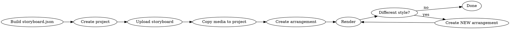

# Cuco Video Engine

## Core Concepts

**Storyboard** = sections with text + media. This is your video content.

**Arrangement** = storyboard + style → rendered output. Each arrangement is a VERSION.

**Style** = visual template (fonts, layout, motion). Different style = different arrangement.

## Workflow



## Build the Storyboard

Get the structure, then fill it:

```bash
cuco storyboard scaffold --sections=3 > storyboard.json
```

Edit `storyboard.json` with your content:

```json
{
  "sections": [
    {
      "text": "Your narration for section one.",
      "media": [{"filePath": "projects/1/attached_media/image1.jpg", "fileHash": "abc123...", "originalName": "image1.jpg", "fileSize": 12345, "mimeType": "image/jpeg"}],
      "origin": "text",
      "story_source": "text",
      "language": "en",
      "mute": false
    }
  ],
  "soundtrack_duration": 0
}
```

## Commands

```bash
# 1. Create project
cuco project create --name "My Video"
# → ok id=1

# 2. Copy media into project folder
PROJ=~/Library/Application\ Support/CucoStudio/projects/1
mkdir -p "$PROJ/attached_media"
cp image.jpg "$PROJ/attached_media/"
shasum -a 256 "$PROJ/attached_media/image.jpg"  # get hash for storyboard.json

# 3. Build storyboard.json with media references (see above)

# 4. Upload complete storyboard
cuco storyboard update 1 --file storyboard.json

# List styles
cuco --json style list

# Create arrangement with style
cuco arrangement create 1 --patch-json '{"style_id": 7}'
# → ok id=42

# Render
cuco arrangement process 1 42 --render --style-id=7 --wait
# → ok status=COMPLETED

# Output at:
# ~/Library/Application Support/CucoStudio/projects/1/arrangements/42/video.mp4
```

## Multiple Styles

Want the same video in different styles? Create multiple arrangements:

```bash
# Style A
cuco arrangement create 1 --patch-json '{"style_id": 2}'
# → ok id=42
cuco arrangement process 1 42 --render --style-id=2 --wait

# Style B
cuco arrangement create 1 --patch-json '{"style_id": 7}'
# → ok id=43
cuco arrangement process 1 43 --render --style-id=7 --wait
```

Each arrangement = one version. Never re-render the same arrangement with a different style.

## Media Structure

```json
{
  "filePath": "projects/{PROJECT_ID}/attached_media/filename.jpg",
  "fileHash": "sha256-hash-of-file",
  "originalName": "filename.jpg",
  "fileSize": 12345,
  "mimeType": "image/jpeg"
}
```

Get hash: `shasum -a 256 path/to/file.jpg | cut -d' ' -f1`

## Output

```
~/Library/Application Support/CucoStudio/projects/{PROJECT_ID}/arrangements/{ARR_ID}/
├── video.mp4          # Final video
├── thumbnail.png      # Thumbnail
└── screenplay.json    # Generated screenplay
```
